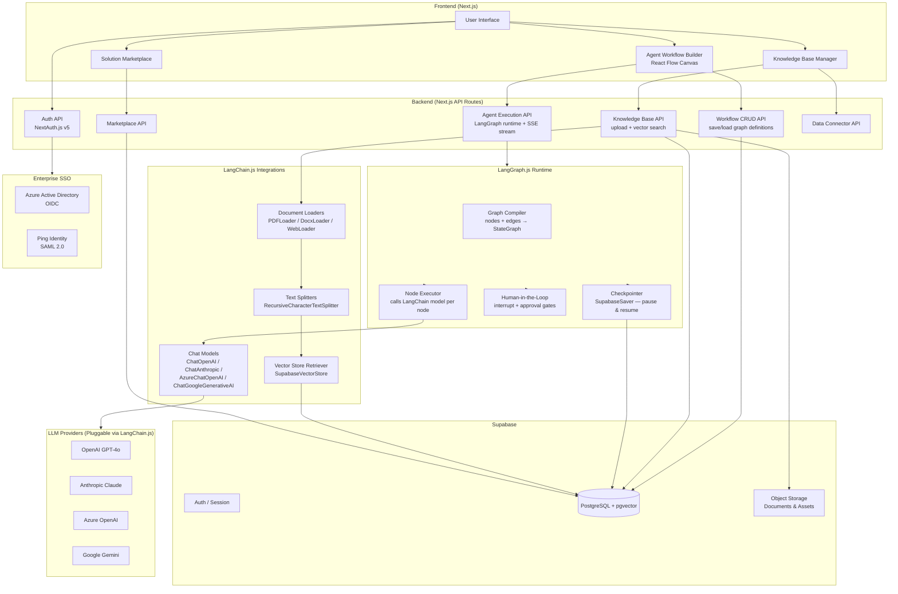
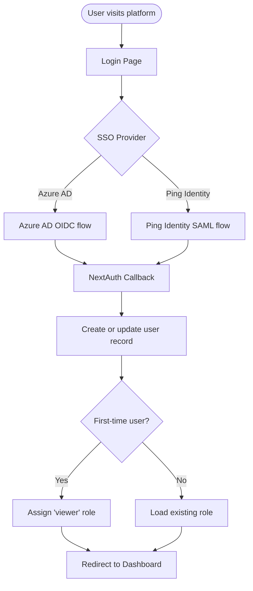
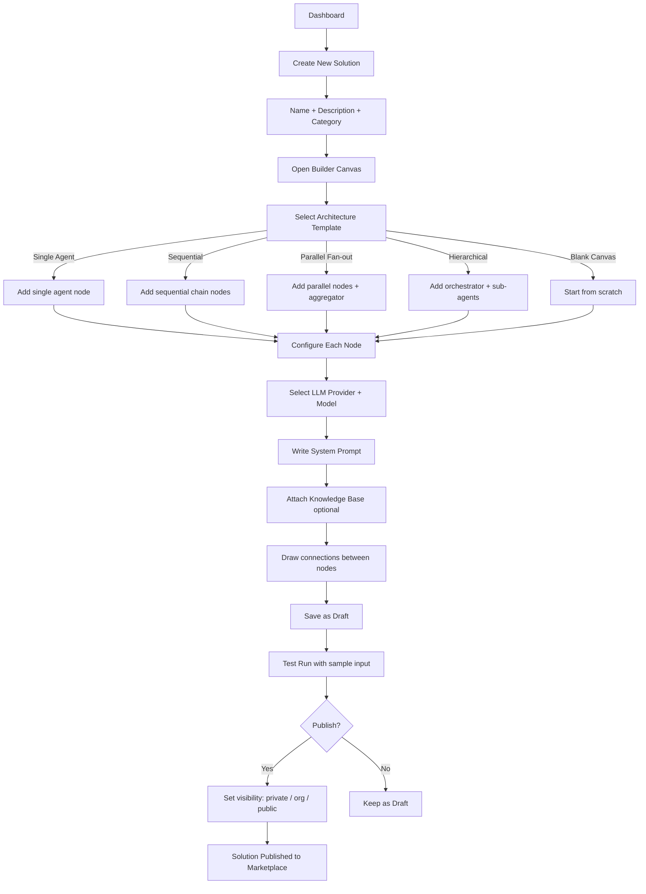
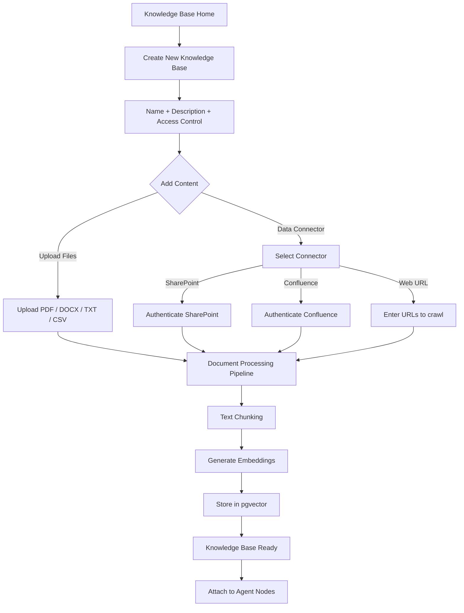
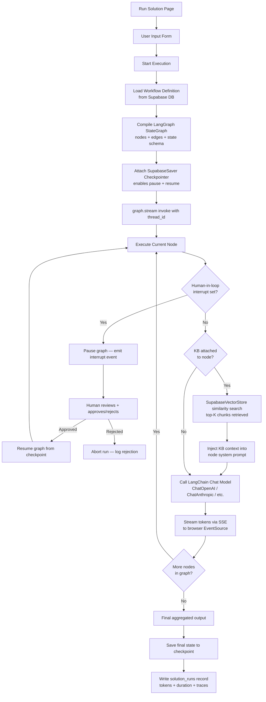
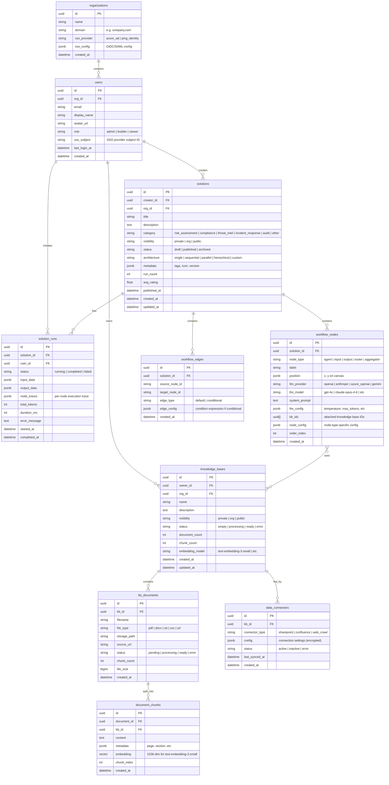

# AgentForge - Security Risk & Governance AI Platform
## Architecture Design Document

## Project Overview

A no-code visual platform for security risk and governance professionals to design, configure, and publish agentic AI solutions. Users drag-and-drop to compose multi-agent workflows, connect knowledge bases, and share solutions with their organization.

---

## Technology Stack

| Layer | Technology |
|-----|---------|
| Frontend | Next.js 14+ (App Router) + TypeScript + Tailwind CSS |
| Drag & Drop Canvas | React Flow (`@xyflow/react`) — custom node types per agent architecture |
| Agent Orchestration | **LangGraph.js** (`@langchain/langgraph`) — stateful graph execution engine |
| LLM Abstraction | **LangChain.js** (`@langchain/core`, `@langchain/openai`, `@langchain/anthropic`, etc.) |
| Backend | Next.js API Routes (execution runtime runs as API route handlers) |
| Database | Supabase (PostgreSQL + pgvector) |
| Authentication | NextAuth.js v5 (SAML/OIDC — Azure AD, Ping Identity) |
| File Storage | Supabase Storage |
| Vector Embeddings | pgvector (Supabase extension) + LangChain vector store integration |
| Document Processing | LangChain.js document loaders + text splitters + embedding pipeline |
| UI Components | shadcn/ui + Radix UI |

> **Framework decision:** LangGraph was selected over Dify, LangFlow, and Flowise after evaluating 8 open-source agentic frameworks. See `agentic_comparison.md` for full analysis. Key reasons: MIT license, TypeScript-native SDK, human-in-the-loop as a first-class feature, full data model ownership, and maximum UX differentiation for security professionals.

---

## 1. System Architecture



---

## 2. Core User Flows

### 2.1 Authentication Flow



### 2.2 Agent Workflow Builder Flow



### 2.3 Knowledge Base Flow



### 2.4 Solution Execution Flow



---

## 3. Data Model



---

## 4. Page Structure

```mermaid
graph TB
    subgraph Auth["Auth Pages"]
        LoginPage[/login - SSO Login]
    end

    subgraph App["Application Pages (Protected)"]
        Dashboard[/ - Dashboard]

        subgraph Builder["Solution Builder"]
            MySolutions[/solutions - My Solutions]
            NewSolution[/solutions/new - New Solution]
            BuilderCanvas[/solutions/:id/edit - Builder Canvas]
            RunSolution[/solutions/:id/run - Run Solution]
            RunHistory[/solutions/:id/history - Run History]
        end

        subgraph KB["Knowledge Base"]
            KBList[/knowledge - KB List]
            KBNew[/knowledge/new - New KB]
            KBDetail[/knowledge/:id - KB Detail]
        end

        subgraph Market["Marketplace"]
            MarketHome[/marketplace - Browse Solutions]
            MarketDetail[/marketplace/:id - Solution Detail]
        end

        subgraph Admin["Admin Panel (admin role only)"]
            AdminUsers[/admin/users - User Management]
            AdminOrg[/admin/org - Org Settings & SSO Config]
            AdminKeys[/admin/keys - LLM API Key Management]
            AdminAudit[/admin/audit - Audit Logs]
        end
    end

    LoginPage --> Dashboard
    Dashboard --> MySolutions
    Dashboard --> KBList
    Dashboard --> MarketHome
    MySolutions --> BuilderCanvas
    MySolutions --> NewSolution
    NewSolution --> BuilderCanvas
    BuilderCanvas --> RunSolution
    RunSolution --> RunHistory
    KBList --> KBNew
    KBList --> KBDetail
    MarketHome --> MarketDetail
    MarketDetail --> RunSolution
```

---

## 5. API Design

### Auth API

| Method | Path | Description |
|--------|------|-------------|
| GET | /api/auth/[...nextauth] | NextAuth.js handler (login, callback, signout) |
| GET | /api/auth/session | Get current session |
| GET | /api/me | Get current user profile + role |

### Solutions API

| Method | Path | Description |
|--------|------|-------------|
| GET | /api/solutions | List user's solutions |
| POST | /api/solutions | Create new solution |
| GET | /api/solutions/:id | Get solution with nodes and edges |
| PATCH | /api/solutions/:id | Update solution metadata |
| DELETE | /api/solutions/:id | Delete solution |
| POST | /api/solutions/:id/publish | Publish solution to marketplace |
| POST | /api/solutions/:id/archive | Archive solution |
| POST | /api/solutions/:id/duplicate | Duplicate solution |

### Workflow API

| Method | Path | Description |
|--------|------|-------------|
| PUT | /api/solutions/:id/workflow | Save entire workflow (nodes + edges) |
| GET | /api/solutions/:id/workflow | Get workflow definition |

### Execution API

| Method | Path | Description |
|--------|------|-------------|
| POST | /api/solutions/:id/run | Start a solution run (streaming SSE) |
| GET | /api/runs/:runId | Get run status and output |
| GET | /api/solutions/:id/runs | Get run history |

### Knowledge Base API

| Method | Path | Description |
|--------|------|-------------|
| GET | /api/knowledge | List user's knowledge bases |
| POST | /api/knowledge | Create knowledge base |
| GET | /api/knowledge/:id | Get KB with documents |
| PATCH | /api/knowledge/:id | Update KB metadata |
| DELETE | /api/knowledge/:id | Delete KB |
| POST | /api/knowledge/:id/documents | Upload documents |
| DELETE | /api/knowledge/:id/documents/:docId | Delete document |
| POST | /api/knowledge/:id/connectors | Add data connector |
| POST | /api/knowledge/:id/sync | Trigger connector sync |
| POST | /api/knowledge/:id/search | Vector similarity search (used by runtime) |

### Marketplace API

| Method | Path | Description |
|--------|------|-------------|
| GET | /api/marketplace | Browse public/org solutions |
| GET | /api/marketplace/:id | Get published solution detail |
| POST | /api/marketplace/:id/rating | Rate a solution |

### Admin API

| Method | Path | Description |
|--------|------|-------------|
| GET | /api/admin/users | List org users |
| PATCH | /api/admin/users/:id | Update user role |
| GET | /api/admin/org | Get org settings |
| PATCH | /api/admin/org | Update org SSO config |
| GET | /api/admin/keys | List configured LLM provider keys |
| PUT | /api/admin/keys/:provider | Set LLM provider API key |
| GET | /api/admin/audit | Get audit log entries |

---

## 6. Agent Architecture Templates

| Template | Description | Node Structure |
|----------|-------------|----------------|
| Single Agent | One LLM agent handles the full task | Input → Agent → Output |
| Sequential Chain | Agents process output in order | Input → Agent1 → Agent2 → ... → Output |
| Parallel Fan-out | Multiple specialized agents run concurrently, results merged | Input → [Agent1, Agent2, Agent3] → Aggregator → Output |
| Hierarchical | Orchestrator delegates to sub-agents | Input → Orchestrator → [SubAgent1, SubAgent2] → Orchestrator → Output |
| Router | Routes input to the most relevant specialist | Input → Router → Agent(selected) → Output |

---

## 7. LangGraph Integration Design

### 7.1 How Canvas Definitions Map to LangGraph StateGraphs

The React Flow canvas stores a visual representation (nodes + edges) in Supabase. At execution time, this is compiled into a LangGraph `StateGraph`:

```typescript
// Stored in Supabase: workflow_nodes + workflow_edges
// At execution time in /api/solutions/:id/run:

import { StateGraph, Annotation } from "@langchain/langgraph";
import { SupabaseSaver } from "./checkpointer"; // custom checkpointer

const AgentState = Annotation.Root({
  userInput: Annotation<string>(),
  messages: Annotation<BaseMessage[]>({ reducer: messagesReducer }),
  nodeOutputs: Annotation<Record<string, string>>(),
});

const graph = new StateGraph(AgentState);

// Add nodes dynamically from workflow_nodes DB records
for (const node of workflowNodes) {
  graph.addNode(node.id, buildNodeFunction(node)); // buildNodeFunction creates the LangChain model call
}

// Add edges from workflow_edges DB records
for (const edge of workflowEdges) {
  if (edge.edge_type === "conditional") {
    graph.addConditionalEdges(edge.source_node_id, buildConditionFn(edge));
  } else {
    graph.addEdge(edge.source_node_id, edge.target_node_id);
  }
}

graph.setEntryPoint(inputNodeId);
graph.setFinishPoint(outputNodeId);

const checkpointer = new SupabaseSaver(supabase);
const compiled = graph.compile({ checkpointer, interruptBefore: hitlNodeIds });

// Stream execution with SSE
for await (const event of compiled.streamEvents({ userInput }, { version: "v2", configurable: { thread_id: runId } })) {
  res.write(`data: ${JSON.stringify(event)}\n\n`);
}
```

### 7.2 Human-in-the-Loop (HITL) Pattern

Agent nodes can be marked as requiring human approval before execution. This uses LangGraph's `interruptBefore` feature:

```
User starts run → graph executes → reaches HITL node → graph pauses
→ SSE emits { type: "interrupt", nodeId, pendingInput }
→ UI shows approval panel to user
→ User approves → POST /api/runs/:runId/resume { approved: true }
→ graph.updateState + graph.stream resumes from checkpoint
→ execution continues
```

### 7.3 Supported Agent Architecture Patterns in LangGraph

| Pattern | LangGraph Implementation |
|---------|------------------------|
| Single Agent | Single node StateGraph with one LLM call |
| Sequential Chain | Linear edges: A → B → C → END |
| Parallel Fan-out | One node fans to multiple nodes via `Send()` API; aggregator node merges |
| Hierarchical (Supervisor) | Supervisor node uses `Command` to route to sub-agent nodes |
| Router | Conditional edges from router node based on LLM output classification |

### 7.4 LangGraph Packages Used

| Package | Purpose |
|---------|---------|
| `@langchain/langgraph` | Core graph engine, StateGraph, Annotation, Send, Command |
| `@langchain/core` | BaseMessage, HumanMessage, AIMessage, SystemMessage |
| `@langchain/openai` | ChatOpenAI, OpenAIEmbeddings |
| `@langchain/anthropic` | ChatAnthropic |
| `@langchain/google-genai` | ChatGoogleGenerativeAI |
| `@langchain/community` | AzureChatOpenAI, SupabaseVectorStore, PDF/DOCX loaders |

---

## 8. Supported LLM Providers

| Provider ID | LangChain Class | Models Available |
|-------------|----------------|-----------------|
| openai | `ChatOpenAI` | gpt-4o, gpt-4o-mini, gpt-4-turbo |
| anthropic | `ChatAnthropic` | claude-opus-4-6, claude-sonnet-4-6, claude-haiku-4-5 |
| azure_openai | `AzureChatOpenAI` | gpt-4o (deployment name configurable per org) |
| gemini | `ChatGoogleGenerativeAI` | gemini-2.0-flash, gemini-1.5-pro |

---

## 9. Enterprise SSO Configuration

### Azure Active Directory (OIDC)
- Protocol: OpenID Connect
- NextAuth provider: `AzureADProvider`
- Required config: `AZURE_AD_CLIENT_ID`, `AZURE_AD_CLIENT_SECRET`, `AZURE_AD_TENANT_ID`
- Token claims mapped to: user.email, user.name, user.groups (for role mapping)

### Ping Identity (SAML 2.0)
- Protocol: SAML 2.0
- NextAuth provider: custom SAML provider via `next-auth-saml`
- Required config: `PING_ENTITY_ID`, `PING_SSO_URL`, `PING_CERTIFICATE`
- Attributes mapped to: email, displayName, groups

---

## 10. Knowledge Base Document Processing Pipeline

Uses **LangChain.js document loaders and text splitters** — no custom parsing code needed:

```
Upload → Supabase Storage
→ LangChain PDFLoader / DocxLoader / TextLoader
→ RecursiveCharacterTextSplitter (chunkSize: 512, overlap: 50)
→ OpenAIEmbeddings (text-embedding-3-small)
→ SupabaseVectorStore.addDocuments()  ← stores chunks + vectors in pgvector
→ Update document status: ready
```

At query time (inside LangGraph node execution):
```
Node's attached KB IDs → SupabaseVectorStore.similaritySearch(query, topK: 5)
→ Top-K chunks retrieved → formatted as context string
→ Injected into node's system prompt via template variable {kb_context}
→ Passed to ChatModel for generation
```

---

## 11. Environment Variables

```env
# Next.js / NextAuth
NEXTAUTH_URL=http://localhost:3000
NEXTAUTH_SECRET=your_nextauth_secret

# Supabase
NEXT_PUBLIC_SUPABASE_URL=your_supabase_url
NEXT_PUBLIC_SUPABASE_ANON_KEY=your_supabase_anon_key
SUPABASE_SERVICE_ROLE_KEY=your_service_role_key

# Azure AD SSO (OIDC)
AZURE_AD_CLIENT_ID=your_azure_client_id
AZURE_AD_CLIENT_SECRET=your_azure_client_secret
AZURE_AD_TENANT_ID=your_azure_tenant_id

# Ping Identity SSO (SAML) - optional
PING_ENTITY_ID=your_ping_entity_id
PING_SSO_URL=your_ping_sso_url
PING_CERTIFICATE=your_ping_certificate_base64

# LLM Providers — fallback dev keys (prod keys stored encrypted per org in DB)
OPENAI_API_KEY=your_openai_key
ANTHROPIC_API_KEY=your_anthropic_key
AZURE_OPENAI_API_KEY=your_azure_openai_key
AZURE_OPENAI_ENDPOINT=your_azure_openai_endpoint
AZURE_OPENAI_API_VERSION=2024-02-01
GOOGLE_AI_API_KEY=your_google_ai_key

# Encryption (for storing connector credentials and LLM keys securely in DB)
ENCRYPTION_KEY=32_byte_hex_string

# LangGraph (if using LangSmith for tracing — optional but recommended for debugging)
LANGCHAIN_TRACING_V2=true
LANGCHAIN_API_KEY=your_langsmith_key
LANGCHAIN_PROJECT=agentforge
```

---

## 12. Security Considerations

- All API routes require authenticated session (middleware enforced)
- Role-based access: `admin` > `builder` > `viewer`
- LLM API keys stored encrypted in DB (per org), never exposed to frontend
- Knowledge base access controlled per visibility level (private / org / public)
- All user actions logged to audit log table
- SSO tokens validated server-side; no client-side JWT manipulation
- Document uploads scanned for size limits (max 50MB per file)
- Rate limiting on execution API to prevent abuse
